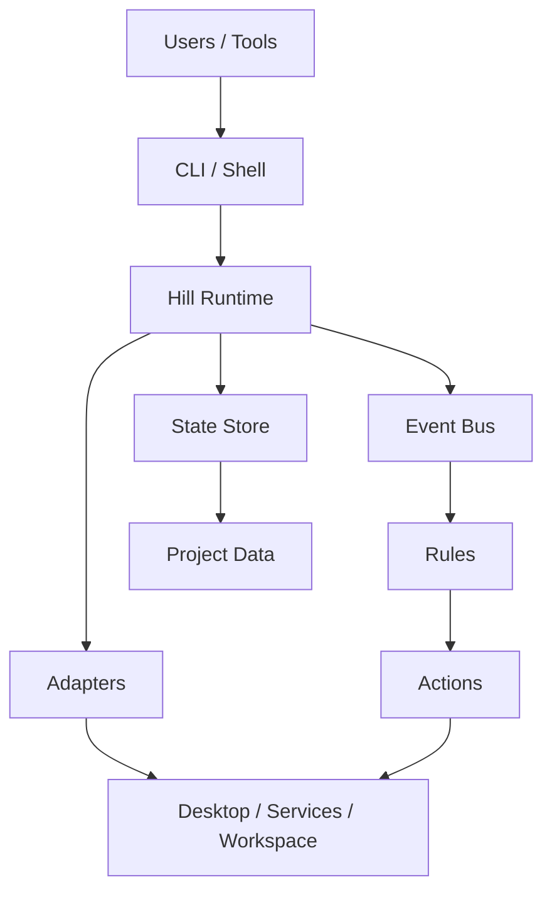

# ProjectHiLL


Hill is a programmable workspace operating system for developers.

It isn't another window manager—it's a runtime for intelligent workspaces.

Hill treats a project as something you can enter, restore, and operate, instead of something you manually rebuild every time you switch context.

## Overview

- Project-centric workspace runtime
- Local-first and event-driven
- Built for restoring development context across terminals, services, and workspace state

## What you can do
 
- Register and manage projects
- Restore project context from a single command
- Observe workspace events through a structured event bus
- Extend the system through adapters and plugins

## Architecture



Hill is designed as a runtime, not a one-off utility:

- Requests enter through the CLI or shell.
- The runtime coordinates state and events.
- Adapters bridge external systems.
- Rules transform events into workspace actions.


## Repository layout

```text
hill/
  crates/
    hill-runtime/
    hill-cli/
    hill-shell/
    hill-config/
    hill-types/
```


## Screenshots


## Status

Hill is under active development.


## Releases

- `v0.1.0-alpha`
- `v0.2.0-alpha`
- `v0.3.0-alpha`


