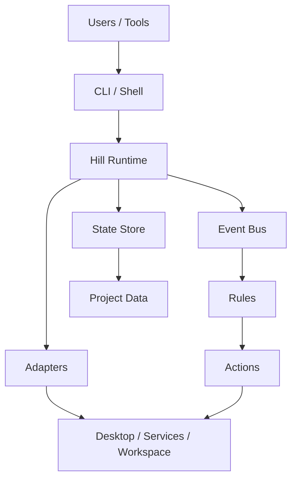

# ProjectHiLL

Hill is a programmable workspace operating system for developers.

Not another window manager.
A runtime for intelligent workspaces.

Hill treats a project as something you can enter, restore, and operate, instead of something you manually rebuild every time you switch context.

## What it is

- Project-centric workspace runtime
- Local-first and event-driven
- Built for restoring development context across terminals, services, and workspace state

## What you can do
 
- Register and manage projects
- Restore project context from a single command
- Observe workspace events through a structured runtime
- Extend the system through adapters and plugins

## Architecture



Hill is designed as a runtime, not a one-off utility:

- requests enter through the CLI or shell
- the runtime coordinates state and events
- adapters bridge external systems
- rules turn events into workspace actions


## Repository layout

```text
hill/
  crates/
    hill-runtime/
    hill-cli/
    hill-shell/
    hill-config/
    hill-types/
```

## Public docs

- [Architecture](docs/architecture.md)
- [Runtime](docs/runtime.md)
- [Event System](docs/event-system.md)
- [Plugin System](docs/plugin-system.md)
- [Configuration](docs/configuration.md)
- [Roadmap](docs/roadmap.md)

## Screenshots


## Status

Hill is under active development.

The public repo is intentionally high level. Detailed implementation notes, internal design decisions, and private planning material should stay out of the public README.

## Releases

- `v0.1.0-alpha`
- `v0.2.0-alpha`
- `v0.3.0-alpha`

## License

MIT
